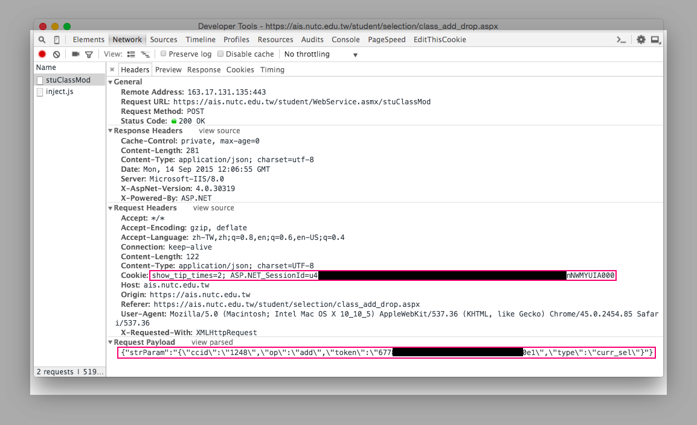

# 台中科大自動選課機器人
選課人數滿了，雖然可以特殊加退選，但是秉持著 hack 精神，寫了小機器人讓他選吧

## Installation
把 repository clone 至 local

```shell
$ git clone git@github.com:jigsawye/nutc-get-course.git
```

安裝 dependence

```shell
$ cd nutc-get-course
$ composer install
```

## Usage
1. 將 `config.example.php` 重新命名為 `config.php`

1. 打開 browser 的 devtools 切到 `Network`，找一門你想選的課，然後點加選，接著會出現一個 Name 為 `stuClassMod` 的 request。
1. 將 `stuClassMod` Requests Headers 中的 cookie 及 Requests Payload 複製，並貼到 `config.php` 對應的位置  


1. 執行程式

```shell
$ php root.php
```

## License
WTFPL